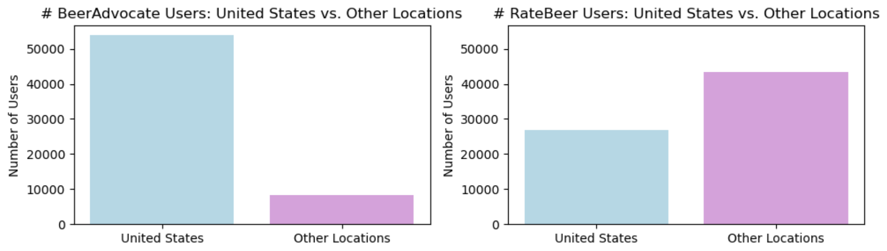
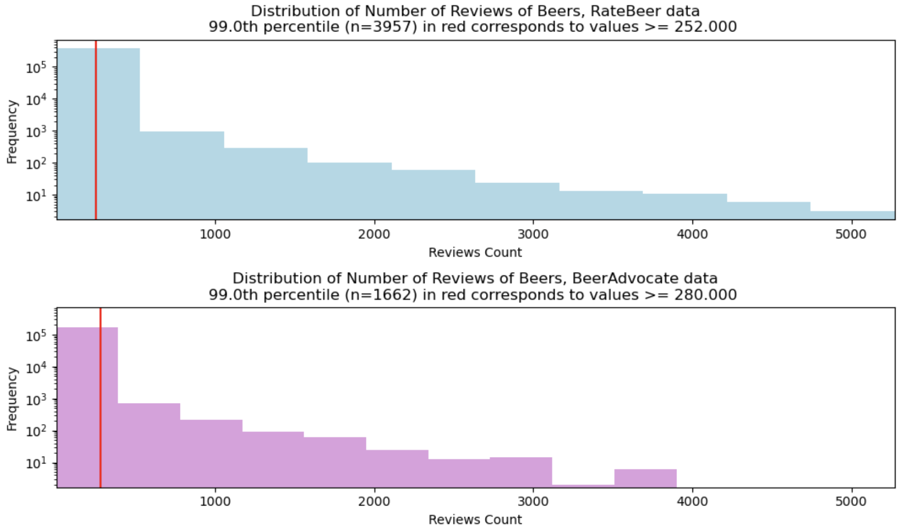

# ADA Project : Light Ale, Big Fail: What Beer Reviewers Hate the Most

## Description

### Abstract
People’s likes and preferences are usually the subject of much attention, but understanding what people actively hate can reveal deeper insights into user satisfaction and product improvement. In this project, we aim to extract the main criticisms of beer reviewers, focusing on the specific qualities and characteristics that generate dissatisfaction among reviewers. By examining a large dataset containing around 2.5 million reviews collected from the beer review website RateBeer, we investigate how different attributes—such as flavor, alcohol content, appearance, or aroma—impact user ratings and contribute to lower scores. Additionally, we explore patterns in user behavior that indicate negativity beyond typical preferences, potentially identifying if factors like location or cultural expectations affect specific dislikes. We will augment our data with features extracted from textual reviews using text and emotion analysis.

### Research Questions
- How can we extract beer characteristics from textual reviews? How do the different characteristics of a beer impact the rating given to the beer?
- Are some users (e.g. by location) more critical of certain characteristics? 
Can we identify the beer characteristics people hate by focusing on the worst reviews?
- How can we even define a bad review? What patterns can we find when it comes to complaints (e.g. by location, beer styles, etc) ?

### Data
While the BeerAdvocate dataset has many more users, RateBeer users are much more active and also more diverse in terms of location. RateBeer users also write more reviews. In fact, RateBeer has 7M reviews (ratings with text) while BeerAdvocate has 2.5M (it has more ratings but we only work on reviews). The plots below indicate that :
- RateBeer (7M) has more reviews than BeerAdvocate (2.5M)
- RateBeer has more reviews per beer than BeerAdvocate
- RateBeer has more reviews per users than BeerAdvocate
- Around 60% of RateBeer users are outside of the US, while a vast majority of the BeerAdvocate users are US-based, which might make analysis by location not very significant statistically





For these reasons we choose to work on the RateBeer dataset, which contains 442k beers, 24k breweries and 70k users. We choose to augment our beer descriptions by extracting beer characteristics from the textual reviews (see task 1). One of the challenges with our data is that some reviews are written in other languages (e.g. Polish), and some have encoding issues. Initially, we wanted to add production data (e.g. fermentation characteristics, etc.) and we found a dataset from [Brewer's Friend](http://www.brewersfriend.com), but unfortunately these aren’t the real recipes for the beers, only imitations and after struggling with matching the beers in our dataset with this new dataset, we decided to abandon this idea.

### Project Plans & Methods

#### Task 1 : extracting beer features from reviews
We begin by aggregating the reviews and quantitative data for each beer, extracting qualitative features from textual reviews, and combining ratings and other data to compute the specific flavor profile and characteristics of each beer. This allows us to have richer descriptions for further analysis.
We use lemmatization and tf-idf for textual analysis, and weight the reviewers’ contributions by their “expert” status. We investigate different ways of using tf-idf on our data, and according to our preliminary analysis, even with the amount of data we have, it should run in a few hours at most. For visualization purposes, we use word clouds, world maps and otherwise plots.
#### Task 2 : defining negative reviews

What makes a review a bad one? We could just look at the rating, but we would miss reviews that have good ratings but have specific complaints (“great beer overall, but the bitterness is too much for me personally”).
We try different methods:
Take the worst rated reviews for each beer, i.e. just the numerical rating.
Focus on inflammatory keywords often used when complaining, based on our data analysis.
Text and emotion analysis using a model we found to find specific complaints, even in high-rated reviews. For this to work at the scale of our data, we use a GPU for much faster inference.

#### Task 3 : Identifying the reviewers’ key complaints
We then extract key complaints from reviews, and find insights into users’ dislikes.
We use tf-idf to find words that are significant in negative reviews compared to positive ones. This part is really about going into detail about the text analysis : choosing the “n” in n-grams, lemmatization, stripping accents, removing stopwords, how to apply tf-idf specifically, etc.
We investigate, among others, the following questions:
Are certain beer characteristics—such as aroma, appearance, flavor or bitterness—more prone to being disliked (i.e., 'risky')?
Are there complaints that are specific to a certain type of beer that can be learned from reviews ? 
What insights could we provide to breweries?
Do people in certain regions have common complaints or higher expectations?
Do beers from certain regions have identifiable weaknesses?

#### Timeline
15.11 Load and clean the data, do the pre-analysis
22.11 Refine the story
06.12 Implement tasks 1, 2 and 3
13.12 Finish the final presentation to submit
20.12 Milestone 3 deadline, finalize the Github page

#### Team Organization
Leonardo : Task 1, Task 3
Luka : Task 2, Task 3
Saba : Task 1, Task 3
Sama : Task 2, Task 3
Shahrzad : Task 1, Task 3

## Quickstart

```bash
# clone project
git clone <project link>
cd <project repo>

# [OPTIONAL] create conda environment
conda create -n <env_name> python=3.11 or ...
conda activate <env_name>


# install requirements
pip install -r pip_requirements.txt
```

Download `RateBeer.tar.gz` package from this [Google Drive](https://drive.google.com/drive/folders/1Wz6D2FM25ydFw_-41I9uTwG9uNsN4TCF?usp=sharing).
Extract data, and put it into the data folder at the root. The expected structure should be data/RateBeer/beers.csv, data/RateBeer/users.csv, data/RateBeer/reviews.txt, data/RateBeer/ratings.txt, data/RateBeer/breweries.csv


## Project Structure

The directory structure of new project looks like this:

```
├── data                        <- Project data files
│   ├── RateBeer                <- RateBeer dataset, as described above
│
├── src                         <- Source code
│
├── tests                       <- Tests of any kind
│
├── milestone-2.ipynb           <- milestone 2 notebook containing initial data cleaning and analysis, and basic pipeline
│
├── .gitignore                  <- List of files ignored by git
├── pip_requirements.txt        <- File for installing python dependencies
└── README.md
```
