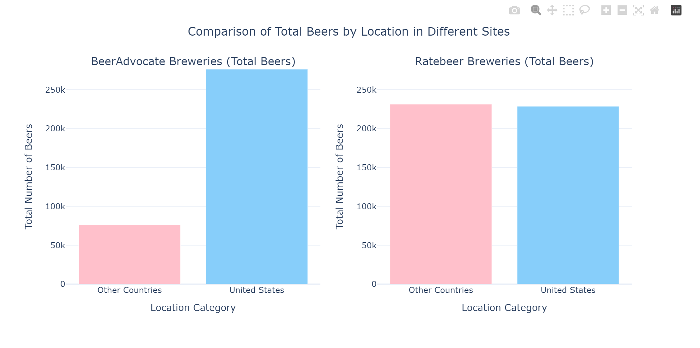
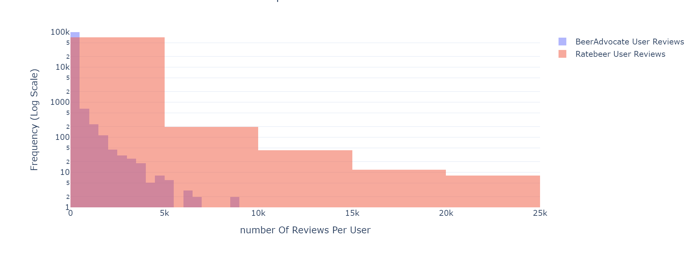

# ADA Project : Light Ale, Big Fail: What Beer Reviewers Hate the Most

## Description

Link to website data story : https://epfl-ada.github.io/ada-2024-project-awesomedataanalysts/

### Abstract
People’s likes and preferences are usually the subject of much attention, but let’s be honest, people LOVE to complain (especially the french). Whether it's about a movie or a pint of beer, when it comes to dislikes, people get straight to the point. Instead of just focusing on what people love, we're diving deep into what they hate about their beer. Complaints hold clues, they are raw and unfiltered, and reveal exactly what really matters to people and where a particular product falls short.
The secret to making this work ? Data, so much data. In this project, we use 7 million beer reviews from the beer review RateBeer, where tens of thousands of reviewers have described their experiences with tens of thousands of beers. By analyzing reviewers' main critiques across key attributes like aroma, flavor, beer style or country of origin, we aim to precisely pinpoint what people hate. Because the key to making the good stuff is understanding the bad stuff.

### Research Questions
- Can we extract beer characteristics and criticisms from textual reviews?
- What are the main factors contributing to the hate sentiment towards certain beers?
- What are factors that make up a "negative" review?
- What characteristic of a beer is a specific criticism aimed at?
- Do beers from certain regions have identifiable weaknesses? What are the main criticisms for each beer style?

### Data

We are provided with textual reviews and beer ratings, covering the years from 2001 to 2017. This data is extracted from 2 beer review websites : RateBeer and BeerAdvocate. The reviews are written by users of the website. The 2 datasets contain the same features. We will mostly work on the text-based features : written review, beer style, location, etc. We choose to work on RateBeer, and not BeerAdvocate or a combination of both, for the following reasons.

We analyze beers, not users, so in a nutshell we need many beers with many reviews. Also, our idea is to extract information from textual reviews, so the numerical ratings themselves are unimportant. For this reason, we care about
- The number of textual reviews : RateBeer has 7M, versus BeerAdvocate's 2.5M.
- The distribution of the number of reviews by beer : RateBeer has more beers with many reviews, compared to BeerAdvocate. See plot below.
- The geographic diversity of the beers reviewed (for analysis by location) : RateBeer beers are much more international, while a majority of BeerAdvocate beers are from the USA, which makes analysis by location not very significant statistically for countries outside the USA. See plot below. (Note that RateBeer users are also more international than BeerAdvocate users, but this is not the topic of our analysis.)
- Additionally, we rely on experienced users' precise wording in reviews. On average (see plot below), RateBeer users have written more reviews than BeerAdvocate users.






We choose not to work on a combination of both datasets, because
- There is overlap between the two datasets (some beers appear in both), but matching them precisely is difficult. The beer and brewery names differ slightly in the datasets, so we would need to rely on text similarity. The provided matched data only includes beers that are clearly the same (based on similar names and breweries with no ambiguity, see [When Sheep Shop: Measuring Herding Effects in Product Ratings with Natural Experiments](https://dlab.epfl.ch/people/west/pub/Lederrey-West_WWW-18.pdf)). While this ensures accuracy, it significantly reduces the amount of data to avoid false matches. If we merged the datasets this way, we’d lose a lot of data due to these ambiguities. Alternatively, we could combine the datasets without worrying about duplicate beers, but this would not be rigorous from a data analysis standpoint.
- Our analysis of RateBeer already pushes the limits of the hardware we have. For example, running text analysis methods takes a long time: a few hours for attribute and criticism extraction using tf-idf, a few hours for criticism classification, and overnight for emotion analysis. Adding more data would likely increase computation time and memory requirements beyond what we can handle.
- Combining the two datasets would skew the geographic diversity since BeerAdvocate’s beers are mostly from the USA. This isn’t necessarily a problem, but we already have plenty of data for beers from the USA. Instead, data from underrepresented regions, like Eastern Europe, where reviews are currently lacking, would be more valuable and may be worth the extra effort.

We choose to augment our beer descriptions by extracting beer characteristics from the textual reviews (see tasks). Non-english reviews were identified with [langid](https://github.com/saffsd/langid.py) and dropped.

Initially, we wanted to add production data (e.g. fermentation characteristics, etc.) and we found a dataset from [Brewer's Friend](http://www.brewersfriend.com), but unfortunately these aren’t the real recipes for the beers, only imitations by brewers who try to emulate the taste, so we decided to abandon this idea.

### Project Plans & Methods

#### Task 1 : Defining The Corpus

The main focus of our analysis is the textual reviews of the different beers. As such, we choose to restrict our analysis to beers with more than 300 reviews.
First, non-english reviews are dropped, then the text is converted to lowercase, accents are removed, and the encoding of the apostrophe character ’ is fixed (it is encoded as â\x80\x99 in the data). For tokenizing, we select words with 3 or more characters [a-z] (no numbers), and we further use lemmatization to get to the core of each word, eg ignoring the difference "sucks" and "sucked".
Then we introduce "expert" users, whose contributions are given a bigger weight as their experience is extremely valuable. We select the experts to be those that are in the top 5% of users with the most reviews, and we give their reviews five-fold the importance.
Finally, to build the corpus we concatenate each beer's reviews as one large text (for experts we concatenate their review 5 times instead of 1). Later, when we discuss positive and negative reviews, each beer will instead have one text for positive reviews and another for negative reviews.

#### Task 2 : Extracting Beer Characteristics And Criticisms

There are 2 types of features we are interested in : characteristics that describe a beer, and criticisms regarding a beer. To extract beer attributes, we define the corpus as explained in task 1, and we do term-frequency-inverse-document-frequency (tf-idf) analysis (and choose the words with the highest scores) to extract the specific words that describe each beer. We only consider 1-grams (words) because 2-grams and higher weren't very good. We also choose to remove words that appear too often in the english (eg and) or too often in our corpus (eg beer), to really focus on specifics.
To extract criticisms, we first split the reviews into two sets, the first is called "positive" reviews while the other is called "negative" reviews, and create one positive corpus and one negative corpus. We use 2 methods for splitting the reviews. The first one is simple, we consider the numerical rating given by the reviewer and split at the 10th quantile. Anything above is "positive", anything below is "negative". This approach of comparing high-rated and low-rated reviews works well for finding obvious criticisms, as low-rated reviews tend to be straightforward and direct about negative feedback. For the second method, we use the emotion analysis model [Emotion English DistilRoBERTa-base](https://huggingface.co/j-hartmann/emotion-english-distilroberta-base) specifically on high-rated reviews, hoping to extract more subtle or mixed feedback. For example, a positive review might include some constructive criticism, but it can be harder to spot since the overall tone is positive. Specifically, we split the reviews into sentences and then classify their emotional tone, selecting "positive" text as corresponding to emotions joy an neutral, and "negative" text as disgust and sadness.
With these 2 ways to define the positive and negative corpus, we can now run tf-idf analysis on the positive and negative corpus separately, and then for each word, we subtract its score for the negative corpus by its score for the positive corpus, ensuring that words that are specific only to negative reviews (eg criticism) are extracted.

#### Task 3 : Identifying Key Complaints

To better understand the attributes we extract in task 2, we classify the extracted features using the [bart-large-mnli](https://huggingface.co/facebook/bart-large-mnli) model into the following categories : appearance, aroma, palate and taste.
To identify key insights into users' dislikes, we aggregate and visualize beer characteristics and criticism by brewery location and beer style. We also tried to aggregate by alcohol content by first discretizing into intervals, but the results were not satisfactory.

#### Timeline
- 15.11 Load and clean the data, do the pre-analysis
- 22.11 Refine the story
- 06.12 Implement tasks 1, 2 and 3
- 13.12 Finish the final notebook to submit
- 20.12 Milestone 3 deadline, finish the website

#### Team Organization
- Leonardo : defining the corpus (task 1), tf-idf analysis (task 2), story writing 
- Luka : emotion analysis (task 2), story writing 
- Saba : tf-idf analysis (task 2), feature classification (task 3), story writing 
- Sama : plotting, website deployment and editing, story writing 
- Shahrzad : plotting, website deployment and editing, story writing 

## Quickstart

```bash
# clone project
git clone https://github.com/epfl-ada/ada-2024-project-awesomedataanalysts.git
cd ada-2024-project-awesomedataanalysts

# [OPTIONAL] create conda environment
conda create -n <env_name> python=3.11
conda activate <env_name>


# install requirements
pip install -r pip_requirements.txt
```

Download `RateBeer.tar.gz` package from this [Google Drive](https://drive.google.com/drive/folders/1Wz6D2FM25ydFw_-41I9uTwG9uNsN4TCF?usp=sharing).
Extract data, and put it into the data folder at the root. The expected structure should be `data/RateBeer/beers.csv`, `data/RateBeer/users.csv`, `data/RateBeer/reviews.txt`, `data/RateBeer/ratings.txt`, `data/RateBeer/breweries.csv`.


## Project Structure

The directory structure of new project looks like this:

```
├── data                        <- Project data files
│   ├── RateBeer                <- RateBeer dataset (link in Quickstart)
│   ├── RateBeer_processed      <- Processed RateBeer dataset (link in Quickstart)
│
├── src                         <- Source code
│   ├── data_loading.py         <- data loading logic
│   ├── data_processing.py      <- data processing logic, except for text-specific processing like tf-idf
│   ├── models.py               <- processing using ml models, including emotion analysis and attribute classification
│   ├── plot_wordcloud.py       <- wordcloud logic for milestone 2 notebook
│   ├── plots.py                <- plotting logic
│   ├── text_processing.py      <- text processing logic, including tf-idf
│   ├── utils.py                <- utility functions
│
├── milestone-3.ipynb           <- milestone 3 notebook containing all final results and data processing for the data story
│
├── .gitignore                  <- List of files ignored by git
├── pip_requirements.txt        <- File for installing python dependencies
└── README.md
```
